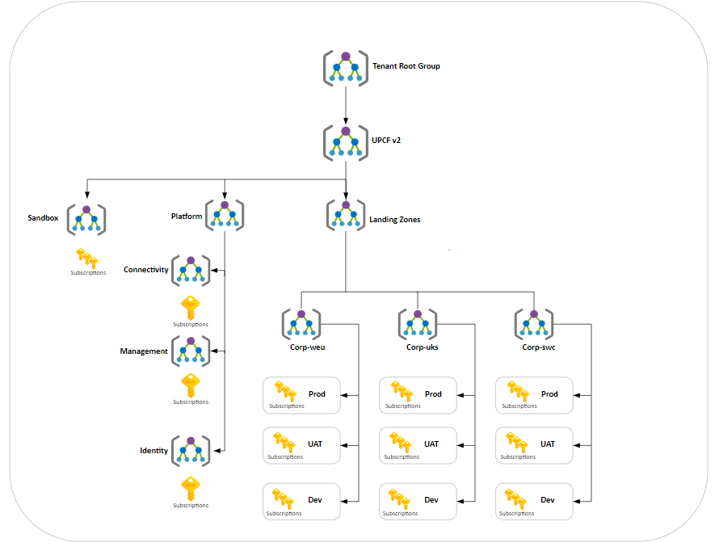
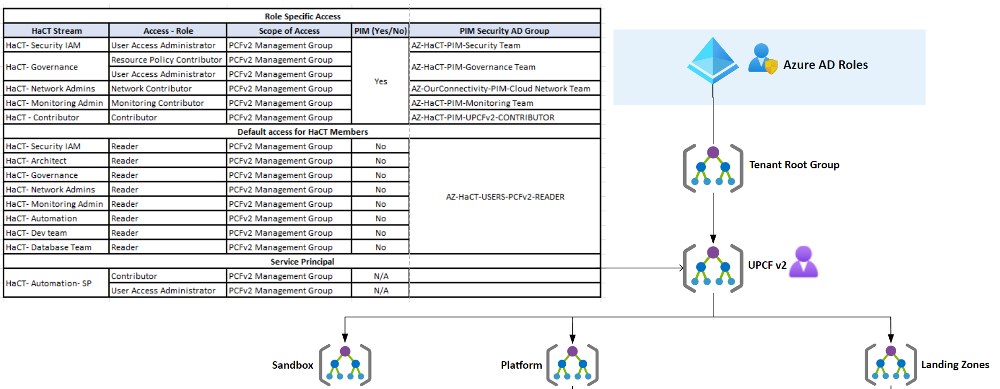
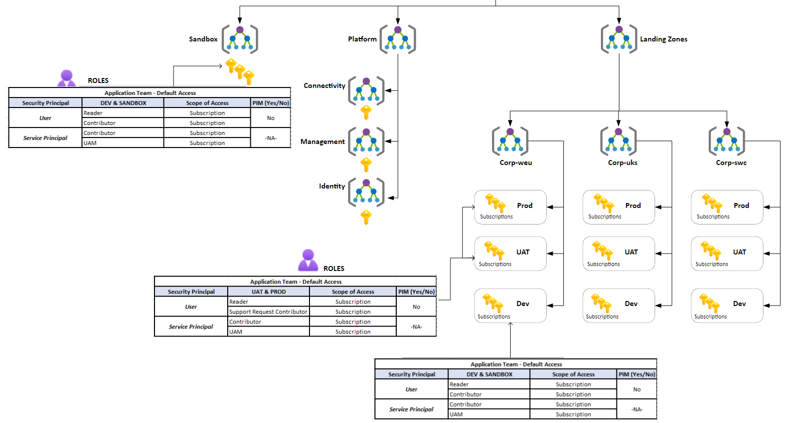
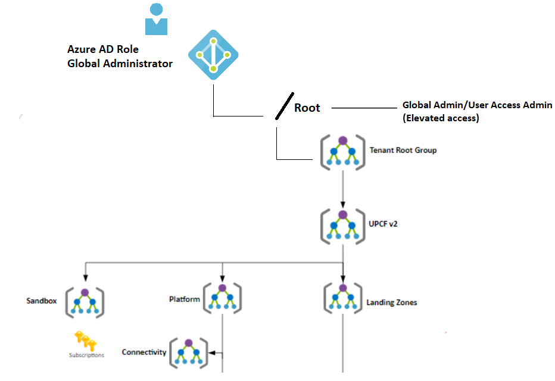
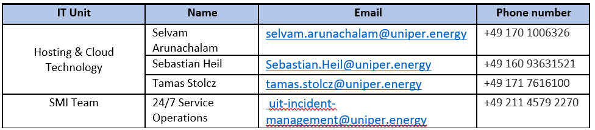

# source

## Table of Contents

- [1. Document Metadata](#1-document-metadata)
  - [1.1. Document Control](#11-document-control)
    - [1.1.1. Document Information](#111-document-information)
    - [1.1.2. Distribution List](#112-distribution-list)
    - [1.1.3. Supporting Documents](#113-supporting-documents)
- [2. Problem Statement](#2-problem-statement)
  - [2.1. Exec Summary](#21-exec-summary)
    - [2.1.1. Overview](#211-overview)
    - [2.1.2. Purpose](#212-purpose)
    - [2.1.3. Audience](#213-audience)
- [3. Design Goals & Non-Goals](#3-design-goals-non-goals)
  - [3.1. In Scope – Out scope of HaCT & Application Team](#31-in-scope-out-scope-of-hact-application-team)
    - [3.1.1. RACI Matrix for Landing Zone subscriptions](#311-raci-matrix-for-landing-zone-subscriptions)
    - [3.1.2. AD Group creation & Role Assignment](#312-ad-group-creation-role-assignment)
    - [3.1.3. Access and Approval for App Team members](#313-access-and-approval-for-app-team-members)
    - [3.1.4. Creation/Deletion new AD Group](#314-creationdeletion-new-ad-group)
    - [3.1.5. Role Assignment](#315-role-assignment)
    - [3.1.6. Custom Role Creation](#316-custom-role-creation)
- [4. Architecture Overview](#4-architecture-overview)
  - [4.1. AS-IS Architecture](#41-as-is-architecture)
    - [4.1.1. Azure Enterprise Scale@Uniper Architecture](#411-azure-enterprise-scaleuniper-architecture)
    - [4.1.2. Azure Enterprise Scale@Uniper – HaCT Cloud Engineer RBAC Architecture](#412-azure-enterprise-scaleuniper-hact-cloud-engineer-rbac-architecture)
    - [4.1.3. Azure Enterprise Scale@Uniper – Application Team RBAC Architecture](#413-azure-enterprise-scaleuniper-application-team-rbac-architecture)
  - [4.2. Application Team - Role Based Access Control](#42-application-team---role-based-access-control)
    - [4.2.1. Application Support Engineers Default Access](#421-application-support-engineers-default-access)
      - [4.2.1.1. Lower Environment – DEV/SANDBOX](#4211-lower-environment-devsandbox)
      - [4.2.1.2. Upper Environment – UAT/PROD](#4212-upper-environment-uatprod)
  - [4.3. Default Authorization – HaCT Team](#43-default-authorization-hact-team)
    - [4.3.1. HaCT – Cloud Engineer – Default Access](#431-hact-cloud-engineer-default-access)
    - [4.3.2. HaCT – Cloud Engineer - Role Specific Access](#432-hact-cloud-engineer---role-specific-access)
    - [4.3.3. HaCT – Automation Service Principal - Role Specific Access](#433-hact-automation-service-principal---role-specific-access)
    - [4.3.4. Azure AD Role – HaCT Security and IAM Team](#434-azure-ad-role-hact-security-and-iam-team)
    - [4.3.5. Approval Workflow](#435-approval-workflow)
- [5. Design Options Considered](#5-design-options-considered)
- [6. Chosen Design & Rationale](#6-chosen-design-rationale)
  - [6.1. Application Team – AD Group Naming Convention](#61-application-team-ad-group-naming-convention)
    - [6.1.1. How are Security AD Groups created?](#611-how-are-security-ad-groups-created)
    - [6.1.2. Naming Convention](#612-naming-convention)
  - [6.2. Default Authorization – Application Team](#62-default-authorization-application-team)
    - [6.2.1. RBAC – Application Team](#621-rbac-application-team)
    - [6.2.2. Azure AD Group Ownership and Membership](#622-azure-ad-group-ownership-and-membership)
- [7. Security, HA & DR Considerations](#7-security-ha-dr-considerations)
  - [7.1. Permission – Azure RBAC for PCFv2](#71-permission-azure-rbac-for-pcfv2)
    - [7.1.1. Permission Details of role](#711-permission-details-of-role)
      - [7.1.1.1. Reader-Permissions](#7111-reader-permissions)
      - [7.1.1.2. Contributor - Permissions](#7112-contributor---permissions)
      - [7.1.1.3. User Access Administrator -Permissions](#7113-user-access-administrator--permissions)
      - [7.1.1.4. Support Request Contributor-Permissions](#7114-support-request-contributor-permissions)
      - [7.1.1.5. Storage Blob Data Reader-Permissions](#7115-storage-blob-data-reader-permissions)
      - [7.1.1.6. Resource Policy Contributor-Permissions](#7116-resource-policy-contributor-permissions)
      - [7.1.1.7. Network Contributor-Permissions](#7117-network-contributor-permissions)
      - [7.1.1.8. Monitoring Contributor-Permissions](#7118-monitoring-contributor-permissions)
  - [7.2. Emergency Break-Glass account](#72-emergency-break-glass-account)
    - [7.2.1. Introduction](#721-introduction)
    - [7.2.2. AS-IS – Break-Glass account Architecture](#722-as-is-break-glass-account-architecture)
    - [7.2.3. Access – Emergency Break-Glass account](#723-access-emergency-break-glass-account)
      - [7.2.3.1. Account Configuration](#7231-account-configuration)
    - [7.2.4. SMEs: Who They Are and How to Contact Them](#724-smes-who-they-are-and-how-to-contact-them)
    - [7.2.5. Validation – Break Glass account](#725-validation-break-glass-account)
  - [7.3. Security - Microsoft Defender for Cloud](#73-security---microsoft-defender-for-cloud)
    - [7.3.1. Policies and Initiatives](#731-policies-and-initiatives)
      - [7.3.1.1. Guest account permission on azure resources](#7311-guest-account-permission-on-azure-resources)
      - [7.3.1.2. Audit for compliance of minimum TLS version](#7312-audit-for-compliance-of-minimum-tls-version)
      - [7.3.1.3. Security features – Storage Account](#7313-security-features-storage-account)
      - [7.3.1.4. Network Policy](#7314-network-policy)
      - [7.3.1.5. SQL Policy Initiatives](#7315-sql-policy-initiatives)
      - [7.3.1.6. KeyVault - Policy Initiatives](#7316-keyvault---policy-initiatives)
- [8. Operational Implications](#8-operational-implications)
  - [8.1. Monitoring and Management](#81-monitoring-and-management)
    - [8.1.1. Alerts on Critical role assignment](#811-alerts-on-critical-role-assignment)
      - [8.1.1.1. Alert Rule](#8111-alert-rule)
      - [8.1.1.2. Action Group](#8112-action-group)
      - [8.1.1.3. Resource Group](#8113-resource-group)
    - [8.1.2. Alerts on creation of new custom role](#812-alerts-on-creation-of-new-custom-role)
      - [8.1.2.1. Alert Rule](#8121-alert-rule)
      - [8.1.2.2. Action Group](#8122-action-group)
      - [8.1.2.3. Resource Group](#8123-resource-group)
    - [8.1.3. Deployment alerts](#813-deployment-alerts)
      - [8.1.3.1. Alert Rule](#8131-alert-rule)
      - [8.1.3.2. Action Group](#8132-action-group)
      - [8.1.3.3. Resource Group](#8133-resource-group)
  - [8.2. Back-Up Plan](#82-back-up-plan)
    - [8.2.1. Role Assignment of Application Team](#821-role-assignment-of-application-team)
      - [8.2.1.1. Purpose](#8211-purpose)
      - [8.2.1.2. Technical Details](#8212-technical-details)
      - [8.2.1.3. Azure Resources](#8213-azure-resources)
      - [8.2.1.4. Scheduler/Pipeline Trigger Details](#8214-schedulerpipeline-trigger-details)
      - [8.2.1.5. Service Principal details](#8215-service-principal-details)
      - [8.2.1.6. Service Principal Azure RBAC Permissions](#8216-service-principal-azure-rbac-permissions)
      - [8.2.1.7. Service Principal Azure AD API Permissions](#8217-service-principal-azure-ad-api-permissions)
    - [8.2.2. Membership of AD group of Application Team](#822-membership-of-ad-group-of-application-team)
      - [8.2.2.1. Purpose](#8221-purpose)
      - [8.2.2.2. Technical Details](#8222-technical-details)
      - [8.2.2.3. Azure Resources](#8223-azure-resources)
      - [8.2.2.4. Scheduler/Pipeline Trigger Details](#8224-schedulerpipeline-trigger-details)
      - [8.2.2.5. Service Principal Details](#8225-service-principal-details)
      - [8.2.2.6. Service Principal Azure RBAC Permissions](#8226-service-principal-azure-rbac-permissions)
      - [8.2.2.7. Service Principal Azure AD API Permissions](#8227-service-principal-azure-ad-api-permissions)
- [9. Risks & Assumptions](#9-risks-assumptions)
  - [9.1. Disclaimer and Important notes](#91-disclaimer-and-important-notes)
      - [9.1.1.1. Role Assignment – scope – Tenant](#9111-role-assignment-scope-tenant)
      - [9.1.1.2. Important Note](#9112-important-note)
- [10. Design Constraints & Dependencies (OPTIONAL)](#10-design-constraints-dependencies-optional)
- [11. Lifecycle & Evolution Considerations (OPTIONAL)](#11-lifecycle-evolution-considerations-optional)
- [12. Out-of-Scope / Deferred Decisions (OPTIONAL)](#12-out-of-scope-deferred-decisions-optional)
- [13. References](#13-references)
- [14. Source-only sections](#14-source-only-sections)
  - [14.1. Role Based Access Control](#141-role-based-access-control)
  - [14.2. Appendix – A Glossary](#142-appendix-a-glossary)

---

## 1. Document Metadata

| Field | Value |
|------|------|
| Document ID |  |
| Domain | Azure Enterprise-Scale / PCF V2 |
| Owning Team | HaCT Team |
| Document Owner | Indhumathi Subramanian |
| Technical Owner | UIT HaCT Security Services |
| Audience | UNIPER architects and UNIPER Enterprise Scale@Uniper project management |
| Status | Draft |
| Version | 1.0 |
| Last Updated | 2023-02-06 |
| Review Cycle |  |

Azure Enterprise-Scale / PCF V2

Low Level Design Document

### 1.1. Document Control

#### 1.1.1. Document Information

| Date | Version | Name | Role | Comments |
| --- | --- | --- | --- | --- |
| 06/02/2023 | 1.0 | Indhumathi Subramanian | Cloud Security & IAM consultant | Initial draft |
|  |  |  |  |  |
|  |  |  |  |  |
|  |  |  |  |  |

Table 1: Document Information

#### 1.1.2. Distribution List

| Distributed to | Role | Company |
| --- | --- | --- |
|  |  |  |
|  |  |  |
|  |  |  |
|  |  |  |

Table 2: Distribution List

#### 1.1.3. Supporting Documents

| Document Name | Version |
| --- | --- |
| Azure Enterprise-Scale / PCF V2 High Level Design Document | Version 1.0 |

Table 3: Supporting Documents

## 2. Problem Statement

### 2.1. Exec Summary

#### 2.1.1. Overview

Uniper has Azure AD at present, which is synced with On-Premises active directory. RBAC is an authorisation system built on Azure Resource Manager that provides fine-grained access management of Azure resources. Using RBAC, you can restrict access based on the need to know and least privilege security principles. Access management for cloud resources is a critical function for UNIPER when using cloud services.

Role-based access control provides each worker privileges based on what role they have in the organization.

#### 2.1.2. Purpose

This LLD documents covers RBAC requirements, detailed RBAC structure, RBAC configurations and maintenance of these RBAC infrastructure which will be deployed in Enterprise Scale@Uniper, its management groups and landing zone subscriptions.

#### 2.1.3. Audience

The intended audience for this document will be UNIPER architects and UNIPER Enterprise Scale@Uniper project management.

## 3. Design Goals & Non-Goals

### 3.1. In Scope – Out scope of HaCT & Application Team

#### 3.1.1. RACI Matrix for Landing Zone subscriptions

| R = Responsibilities A = Accountable C = Consulted I = Informed | Application Team | HaCT Cloud Engineer |
| --- | --- | --- |
| Requesting for new AD group creation other than default | R, A |  |
| Create of role assignment other than default | R, A | C, I |
| Deletion of role assignment other than default | R, A | C, I |
| Access for Application member | R, A |  |
| Process of Approval flow | R, A |  |
| Custom role creation | C, I | R, A |
| Excluding/Exemption of Policy | C, I | R, A |

Table 4: Responsibility assignment matrix

#### 3.1.2. AD Group creation & Role Assignment

| HaCT   Responsibilities |  |
| --- | --- |
| 1. HaCT Team will be creating AD Group and performing default role assignments to Application Team on their ordered subscription. 2. AD Group creation and Role Assignments for HaCT Cloud Engineers are performed manually in MVP1.0 roll out by UIT HaCT Security Services uit-hact-security-services@uniper.energy. 3. PIM implementation of Role Specific access for HaCT Cloud Engineers are manually done by UIT HaCT Security Services [uit-hact-security-services@uniper.energy](mailto:uit-hact-security-services@uniper.energy). |  |
| 1. HaCT Team will be creating AD Group and performing default role assignments to Application Team on their ordered subscription. 2. AD Group creation and Role Assignments for HaCT Cloud Engineers are performed manually in MVP1.0 roll out by UIT HaCT Security Services uit-hact-security-services@uniper.energy. 3. PIM implementation of Role Specific access for HaCT Cloud Engineers are manually done by UIT HaCT Security Services [uit-hact-security-services@uniper.energy](mailto:uit-hact-security-services@uniper.energy). |  |
| 1. HaCT Team will be creating AD Group and performing default role assignments to Application Team on their ordered subscription. 2. AD Group creation and Role Assignments for HaCT Cloud Engineers are performed manually in MVP1.0 roll out by UIT HaCT Security Services uit-hact-security-services@uniper.energy. 3. PIM implementation of Role Specific access for HaCT Cloud Engineers are manually done by UIT HaCT Security Services [uit-hact-security-services@uniper.energy](mailto:uit-hact-security-services@uniper.energy). |  |

Table 5: In/Out Scope - AD Group creation and Role Assignment

#### 3.1.3. Access and Approval for App Team members

| Responsibilities | Responsibilities |
| --- | --- |
| Application Team | HaCT Team |
| Application Manager is responsible to grant access to Application Team member on the required subscription Grant/Revoke access to Application team must be taken care by Application Manager. Application Managers must assess permitted users and give application team members access. | HaCT Team will be creating the default AD Groups with access on the subscriptions ([section 7.2.](#_Naming_Convention)), assign App Manager as Owner of AD Groups of Contributor and Reader ad group & Member of Reader AD Group ([section 8.2.](#_Azure_AD_Group)). Will share the details to App Manager. |

Table 6: In/Out Scope - Access for App Team members

#### 3.1.4. Creation/Deletion new AD Group

| Responsibilities | Responsibilities |
| --- | --- |
| Application Team | HaCT Team |
| Application Team needs to contact the UNIPER Directory Service team. | HaCT is not responsible for creating the AD Group for Enterprise Scale@Uniper except for the default AD Groups. |
| AD Group should be Security type with proper description. | HaCT team will be removing the role assignment of other AD Group type role assignment except Security type ad groups |
| Addition/Removal of Members into the AD Group should be taken care by Application Team or via UNIPER Directory Service team. |  |

Table 7: In/Out Scope - Creation/Deletion new AD Group

#### 3.1.5. Role Assignment

| Responsibilities | Responsibilities |
| --- | --- |
| Application Team | HaCT Team |
| App Team's responsible to perform the role assignment for themselves on-demand | HaCT Team will be working on to identify other critical roles. If HaCT identifies Critical role, it will get appended to the list. |
| Application team are requested to use the Least privilege principle and perform the role assignment. Recommendation from HaCT is to check resource specific role and assign what is required to perform the activity. Critical/High Privilege role - “Owner, User Access Administrator, Resource Policy Contributor “are requested not use across ESLZ subscriptions/Resource Groups/Resources | If in case mentioned role assignments are identified during audit process, HaCT Team will removing immediately |
|  | On noticing role assignments apart from Reader for Application team members in PROD subscription, HaCT Team will be removing the respective role assignment. |

Table 8: In/Out Scope - Role Assignment

#### 3.1.6. Custom Role Creation

| Responsibilities | Responsibilities |
| --- | --- |
| Application Team | HaCT Team |
| Not to create custom role, in most of the use case Contributor access will be sufficient for SPN to deploy/create/modify/update/delete. | When App team creates custom role, Custom role is also will be removed. App Team must place consultation call with HaCT Security & IAM team. In case of valid business justification, Post Service Owner, Application Team will be allowed to create custom role. |
| In case of custom role, request you to take consultation call with HaCT Security & IAM Team |  |

Table 9: In/Out Scope - Custom Role creation

## 4. Architecture Overview

### 4.1. AS-IS Architecture

#### 4.1.1. Azure Enterprise Scale@Uniper Architecture

Figure 1: ES@Uniper Architecture

Remarks: There are role assignments that inherited from the tenant's scope and role assignments that result from policy assignments. The role assignments are tabulated/listed out in the [Table 29](#_Role_Assignment_–)

#### 4.1.2. Azure Enterprise Scale@Uniper – HaCT Cloud Engineer RBAC Architecture

Figure 2: ES@Uniper - HaCT Cloud Engineer Access

#### 4.1.3. Azure Enterprise Scale@Uniper – Application Team RBAC Architecture

Figure 3: ES@Uniper - Application Team Access

Remark: Detailed explanation regarding the default role is provided under the [section 9](#_Application_Team_-).

### 4.2. Application Team - Role Based Access Control

#### 4.2.1. Application Support Engineers Default Access

##### 4.2.1.1. Lower Environment – DEV/SANDBOX

| Security Principal | DEV & SANDBOX | Scope of Access | PIM (Yes/No) |
| --- | --- | --- | --- |
| User | Reader | Subscription | No |
| User | Contributor | Subscription | No |
| Service Principal | Contributor | Subscription | -NA- |
| Service Principal | User Access Administrator | Subscription | -NA- |

Table 10: Application Team Access - Lower Environment

Business Justification/Reason of above role assignments:

Contributor access granted to application users and service principals to deployment of resources.

UAM access is assigned to Application SP to create/delete the role assignments to Application team members and SPs.

PIM is not implemented for Application team members in Lower environment

##### 4.2.1.2. Upper Environment – UAT/PROD

| Security Principal | UAT & PROD | Scope of Access | PIM (Yes/No) |
| --- | --- | --- | --- |
| User | Reader | Subscription | No |
| User | Support Request Contributor | Subscription | No |
| Service Principal | Contributor | Subscription | -NA- |
| Service Principal | User Access Administrator | Subscription | -NA- |

Table 11: Application Team Access - Upper Environment

Business Justification/Reason of above role assignments:

Contributor access granted to application service principals to deployment of resources.

Application team members will have only Reader permissions.

UAM access is assigned to Application SP to create/delete the role assignments to Application team members and SPs.

PIM is not implemented for Application team members in PROD environment because they will be assigned with Reader role as this role will not allow them to modify/delete resources.

### 4.3. Default Authorization – HaCT Team

#### 4.3.1. HaCT – Cloud Engineer – Default Access

| HaCT Stream | Access - Role | Scope of Access | PIM (Yes/No) | Security AD Group |
| --- | --- | --- | --- | --- |
| HaCT- Security IAM | Reader | PCFv2 Management Group | No | AZ-HaCT-USERS-PCFv2-READER |
| HaCT- Architect | Reader | PCFv2 Management Group | No | AZ-HaCT-USERS-PCFv2-READER |
| HaCT- Governance | Reader | PCFv2 Management Group | No | AZ-HaCT-USERS-PCFv2-READER |
| HaCT- Network Admins | Reader | PCFv2 Management Group | No | AZ-HaCT-USERS-PCFv2-READER |
| HaCT- Monitoring Admin | Reader | PCFv2 Management Group | No | AZ-HaCT-USERS-PCFv2-READER |
| HaCT- Automation | Reader | PCFv2 Management Group | No | AZ-HaCT-USERS-PCFv2-READER |
| HaCT- Dev team | Reader | PCFv2 Management Group | No | AZ-HaCT-USERS-PCFv2-READER |
| HaCT- Database Team | Reader | PCFv2 Management Group | No | AZ-HaCT-USERS-PCFv2-READER |

Table 12: Default Access - HaCT Cloud Engineer

Business Justification/Reason of above role assignments:

Default all the HaCT Cloud Engineers must have Reader access from the scope of PCFv2 Management Group to monitor the PCFv2 estate.

As IaaS components are not involved in PCFv2, we are not granting access to HaCT Infra team

Remarks

“AZ-HaCT-USERS-PCFv2-READER“ Reader AD Group will grant only access to ES@Uniper and not used in PCFv1.

AD Group creation and Role Assignment for HaCT Cloud Engineer are manually performed by UIT HaCT Security Services [uit-hact-security-services@uniper.energy](mailto:uit-hact-security-services@uniper.energy)

PIM implementation of Role Specific access for HaCT Cloud Engineers are manually done by UIT HaCT Security Services [uit-hact-security-services@uniper.energy](mailto:uit-hact-security-services@uniper.energy)

#### 4.3.2. HaCT – Cloud Engineer - Role Specific Access

| HaCT Stream | Access - Role | Scope of Access | PIM (Yes/No) | PAG - PIM Security AD Group |
| --- | --- | --- | --- | --- |
| HaCT- Security IAM | User Access Administrator | PCFv2 Management Group | Yes | AZ-HaCT-PIM-Security Team |
| HaCT- Governance | Resource Policy Contributor | PCFv2 Management Group | Yes | AZ-HaCT-PIM-Governance Team |
| HaCT- Governance | User Access Administrator | PCFv2 Management Group | Yes | AZ-HaCT-PIM-Governance Team |
| HaCT- Network Admins | Network Contributor | PCFv2 Management Group | Yes | AZ-OurConnectivity-PIM-Cloud Network Team |
| HaCT- Monitoring Admin | Monitoring Contributor | PCFv2 Management Group | Yes | AZ-HaCT-PIM-Monitoring Team |
| HaCT - Contributor | Contributor | PCFv2 Management Group | Yes | AZ-HaCT-PIM-UPCFv2-CONTRIBUTOR |

Table 13: HaCT Cloud Engineer - Role Specific Access

Business Justification/Reason of above role assignments:

HaCT- Security IAM – To perform create/delete role assignment across PCFv2

HaCT- Governance – To deploy/support Policy in PCFv2 estate

HaCT- Network Admins – To deploy network components like VNet, subnet, VNet Peering, to support Application team member during their Network components deployment

HaCT- Monitoring Admin – Configure Alerts, alert rule, action groups

HaCT – Contributor – To create resource group for HaCT internal purpose if required (on-demand).

Remarks

Except “AZ-HaCT-PIM-UPCFv2-CONTRIBUTOR “all the other PAG AD Groups mentioned in the above Table are used to grant access to HaCT Cloud Engineers in PCFv1 as well as in ES@Uniper.

#### 4.3.3. HaCT – Automation Service Principal - Role Specific Access

| HaCT Stream | Access - Role | Scope of Access | PIM (Yes/No) |
| --- | --- | --- | --- |
| HaCT- Automation - SP | Contributor | PCFv2 Management Group | -NA- |
| HaCT- Automation - SP | User Access Administrator | PCFv2 Management Group | -NA- |

Table 14: HaCT Platform Automation - Service Principal Access

Business Justification/Reason of SP role assignments:

Contributor – To create subscriptions (subscription-Lifecycle), storage account to store deployment state files

User Access Administrator – To perform create/delete role assignment of Application Team

#### 4.3.4. Azure AD Role – HaCT Security and IAM Team

HaCT team must reach out to UNIPER Directory service team to get the roles assigned.

Catalog to place access request with Uniper Directory Service team is [Directory Service - Request Azure / M365 administrator role assignment or removal](https://uniperprod.service-now.com.mcas.ms/unipersp?id=sc_cat_item_uni&sys_id=8b45c7ebdbc820544ceddc03f3961923)

Remark: while placing request, select Azure Active Directory (Uniper SE) PROD

| Role Name | Type | Description |
| --- | --- | --- |
| Privileged Role Administrator | Built-in | Can manage role assignments in Azure AD, and all aspects of Privileged Identity Management. |
| Groups Administrator | Built-in | Members of this role can create/manage groups, create/manage groups settings like naming and expiration policies, and view groups activity and audit reports. |

Table 15: Azure AD Role - HaCT Security and IAM Team

#### 4.3.5. Approval Workflow

Access approval refers to the process of granting permission or authorization to a user to access a particular resource or system. This is typically done by an authorized individual or team who reviews the request and determines if the user has a legitimate need for access and if granting access is in line with the organization's security policies and procedures. Once the approval is granted, the user is provided with the necessary credentials or permissions to access the resource.

As per HaCT IAM standard, HaCT will be Four Eye audit process, i.e two-step approval process.

First Approval from HaCT Head and second approval from respective Service Owner,

| HaCT Head |
| --- |
| Whillans, Mathew <[mathew.whillans@uniper.energy](mailto:mathew.whillans@uniper.energy)> |

Table 16: HaCT Head - Approver

| HaCT Stream Lead | HaCT Stream Lead |
| --- | --- |
| Database | Wittich, Mark <mark.wittich@uniper.energy> |
| Automation | Richards, Gareth <gareth.richards@uniper.energy> |
| Development | Schmitz, Carsten <carsten.schmitz@uniper.energy> |
| Architect | Stolcz, Tamas <Tamas.Stolcz2@uniper.energy> |
| Infrastructure | Arunachalam, Selvam <selvam.arunachalam@uniper.energy> |
| Network | Abbott, Steve <steve.abbott@uniper.energy> |
| Operations | Sidhu, Amerdeep <Amerdeep.Sidhu.ext@uniper.energy> |
| Security & IAM | Heil, Sebastian <sebastian.heil@uniper.energy> |
| Monitoring | Arunachalam, Selvam <selvam.arunachalam@uniper.energy> |
| Optimization | Steinemann, Daniel <Daniel.Steinemann.ext@uniper.energy> |
| Governance | Daniel Steinemann/Sebastian Heil |
| Scrum Board | Röckel, Heike <Heike.Roeckel@uniper.energy> |

Table 17: HaCT Stream - Service Owners

## 5. Design Options Considered

## 6. Chosen Design & Rationale

### 6.1. Application Team – AD Group Naming Convention

#### 6.1.1. How are Security AD Groups created?

Application Owners and Team Members order subscriptions by submitting requests to create subscriptions using catalogue services.

During the process of deployment of Subscriptions via IaC *, respective AD Groups are created with the standard naming convention pattern and Application Managers are assigned as Owners/Member of AD Groups.

Remarks: * Owned/Supported HaCT Automation Team

Detailed explanation about IaC will be covered in Low level design of HaCT Platform automation

AD Group creation and Role Assignment for application team are automated.

#### 6.1.2. Naming Convention

PCFv2 security AD group convention pattern is used.

AZ-              PCFv2-CORP-DEV-C_MA3-DTFU081-01-           READER

| Azure | Subscription Name | Role Name |
| --- | --- | --- |

Table 18

AZ-<Subscription name>-READER

AZ-<Subscription name>-CONTRIBUTOR

Example:

DEV Environment

Subscription Name - "PCFv2-CORP-DEV-C_MA3-DTFU081-01"

AD Group Name - AZ-PCFv2-CORP-DEV-C_MA3-DTFU081-01-READER

Group Description - [CreatedBy:HaCT][CreatedFor:<EAMID of Application>] Granting Reader access for users on subscription.

AD Group Name - AZ-PCFv2-CORP-DEV-C_MA3-DTFU081-01-CONTRIBUTOR

Group Description - [CreatedBy:HaCT][CreatedFor:<EAMID of Application>] Granting Contributor access for users on subscription.

PROD Environment

Subscription Name - "PCFv2-CORP-PRD-C_MA3-DTFU081-01"

AD Group Name - AZ-PCFv2-CORP-PRD-C_MA3-DTFU081-01-READER

Group Description - [CreatedBy:HaCT][CreatedFor:<EAMID of Application>] Granting Reader access for users on subscription.

Remarks: Security AD Group created are only used for the purpose of ES@Uniper RBAC for application team members.

### 6.2. Default Authorization – Application Team

#### 6.2.1. RBAC – Application Team

| Role Name | Type | Description |
| --- | --- | --- |
| Reader | Built-in | View all resources but does not allow you to make any changes. |
| Contributor | Built-in | Grants full access to manage all resources but does not allow you to assign roles in Azure RBAC, manage assignments in Azure Blueprints, or share image galleries. |
| User Access Administrator | Built-in | Let’s you manage user access to Azure resources. |
| Support Request Contributor | Built-in | Let’s you create and manage Support requests |
| Storage Blob Data Reader | Built-in | Allows for read access to Azure Storage blob containers and data |

Table 19: App Team - Default Role Description

#### 6.2.2. Azure AD Group Ownership and Membership

During the deployment of subscription and its respective AD groups, Application Manager will be configured as Owner of Reader and Contributor ad groups.

|  | Reader - AD Group | Contributor - AD Group |
| --- | --- | --- |
| Owner | App Manager | App Manager |
| Member | App Manager, * | * |

Table 20: AAD Group Member and Owner

*Application Manager can add his application team members into the AD Groups depending on the requirement.

## 7. Security, HA & DR Considerations

### 7.1. Permission – Azure RBAC for PCFv2

| Role Name | Type | Description |
| --- | --- | --- |
| [Reader](#_Reader-Permissions) | Built-in | View all resources but does not allow you to make any changes. |
| [Contributor](#_Contributor_-_Permissions) | Built-in | Grants full access to manage all resources but does not allow you to assign roles in Azure RBAC, manage assignments in Azure Blueprints, or share image galleries. |
| [User Access Administrator](#_User_Access_Administrator) | Built-in | Let’s you manage user access to Azure resources. |
| [Resource Policy Contributor](#_Resource_Policy_Contributor-Permiss) | Built-in | Users with rights to create/modify resource policy, create support ticket and read resources/hierarchy. |
| [Network Contributor](#_Network_Contributor-Permissions) | Built-in | Let’s you manage networks, but not access to them. |
| [Monitoring Contributor](#_Monitoring_Contributor-Permissions) | Built-in | Can read all monitoring data and update monitoring settings. |
|  |  |  |

Table 21: Role Description

#### 7.1.1. Permission Details of role

This section is about the permission details of each role from the section 5 and section 6

##### 7.1.1.1. Reader-Permissions

actions:

| "*/read" |
| --- |

Table 22

##### 7.1.1.2. Contributor - Permissions

actions:

| “*” |
| --- |

Table 23

notactions:

| "Microsoft.Authorization/*/Delete", "Microsoft.Authorization/*/Write", "Microsoft.Authorization/elevateAccess/Action", "Microsoft.Blueprint/blueprintAssignments/write", "Microsoft.Blueprint/blueprintAssignments/delete", "Microsoft.Compute/galleries/share/action" |
| --- |

Table 24

##### 7.1.1.3. User Access Administrator -Permissions

actions:

| "*/read", "Microsoft.Authorization/*", "Microsoft.Support/*" |
| --- |

Table 25

##### 7.1.1.4. Support Request Contributor-Permissions

actions:

| "Microsoft.Authorization/*/read", "Microsoft.Resources/subscriptions/resourceGroups/read", "Microsoft.Support/*" |
| --- |

Table 26

##### 7.1.1.5. Storage Blob Data Reader-Permissions

actions:

| "Microsoft.Storage/storageAccounts/blobServices/containers/read", "Microsoft.Storage/storageAccounts/blobServices/generateUserDelegationKey/action" |
| --- |

Table 27

notActions: []

dataActions:

| "Microsoft.Storage/storageAccounts/blobServices/containers/blobs/read" |
| --- |

Table 28

##### 7.1.1.6. Resource Policy Contributor-Permissions

actions:

| "*/read", "Microsoft.Authorization/policyassignments/*”, "Microsoft.Authorization/policydefinitions/*”, "Microsoft.Authorization/policyexemptions/*”, "Microsoft.Authorization/policysetdefinitions/*”, "Microsoft.PolicyInsights/*”, "Microsoft.Support/*” |
| --- |

Table 29

##### 7.1.1.7. Network Contributor-Permissions

actions:

| "Microsoft.Authorization/*/read”, "Microsoft.Insights/alertRules/*”, "Microsoft.Network/*”, "Microsoft.ResourceHealth/availabilityStatuses/read”, "Microsoft.Resources/deployments/*”, "Microsoft.Resources/subscriptions/resourceGroups/read”, "Microsoft.Support/*” |
| --- |

Table 30

##### 7.1.1.8. Monitoring Contributor-Permissions

actions:

| "*/read”, "Microsoft.AlertsManagement/alerts/*”, "Microsoft.AlertsManagement/alertsSummary/*”, "Microsoft.Insights/actiongroups/*”, "Microsoft.Insights/activityLogAlerts/*”, "Microsoft.Insights/AlertRules/*”, "Microsoft.Insights/components/*”, "Microsoft.Insights/createNotifications/*”, "Microsoft.Insights/dataCollectionEndpoints/*”, "Microsoft.Insights/dataCollectionRules/*”, "Microsoft.Insights/dataCollectionRuleAssociations/*”, "Microsoft.Insights/DiagnosticSettings/*”, "Microsoft.Insights/eventtypes/*”, "Microsoft.Insights/LogDefinitions/*”, "Microsoft.Insights/metricalerts/*”, "Microsoft.Insights/MetricDefinitions/*”, "Microsoft.Insights/Metrics/*”, "Microsoft.Insights/notificationStatus/*”, "Microsoft.Insights/Register/Action”, "Microsoft.Insights/scheduledqueryrules/*”, "Microsoft.Insights/webtests/*”, "Microsoft.Insights/workbooks/*”, "Microsoft.Insights/workbooktemplates/*”, "Microsoft.Insights/privateLinkScopes/*”, "Microsoft.Insights/privateLinkScopeOperationStatuses/*”, "Microsoft.OperationalInsights/workspaces/write”, "Microsoft.OperationalInsights/workspaces/intelligencepacks/*”, "Microsoft.OperationalInsights/workspaces/savedSearches/*”, "Microsoft.OperationalInsights/workspaces/search/action”, "Microsoft.OperationalInsights/workspaces/sharedKeys/action”, "Microsoft.OperationalInsights/workspaces/storageinsightconfigs/*”, "Microsoft.Support/*”, "Microsoft.WorkloadMonitor/monitors/*”, "Microsoft.AlertsManagement/smartDetectorAlertRules/*”, "Microsoft.AlertsManagement/actionRules/*”, "Microsoft.AlertsManagement/smartGroups/*”, "Microsoft.AlertsManagement/migrateFromSmartDetection/*” |
| --- |

Table 31

### 7.2. Emergency Break-Glass account

#### 7.2.1. Introduction

Uniper uses Conditional Access and Azure Identity Protection policies to enforce Azure Multi-Factor Authentication (MFA), to block unsupported and incompliant device platforms and to block risky sign-in attempts.

During unforeseen circumstances such as a natural disaster emergency, during which a mobile phone or other networks might be unavailable

In the worst case, these scenarios can block out users and administrator.

Emergency access accounts, often referred to as “break glass accounts”, is an important part of an organization’s disaster recovery plan. These accounts are highly privileged and should only be used when normal admin accounts can’t sign in to gain access to a system or service.

#### 7.2.2. AS-IS – Break-Glass account Architecture

Figure 4: Break-Glass account Access Framework

#### 7.2.3. Access – Emergency Break-Glass account

##### 7.2.3.1. Account Configuration

The "break glass accounts," also known as emergency access accounts, are highly privileged cloud-only accounts that are not covered by any identity-protection services. In an emergency, this makes sure that at least these accounts can log in to the Azure environment.

| Category | Current Configuration |
| --- | --- |
| Password | The password for each emergency access account must be set to ‘never expire’ |
| Password | A high complex password with at least 16 characters must be set. |
| Azure AD Role | Global Administrator |
| Azure AD Role | The role assignment must not be set to be eligible in Privileged Access Management (PIM), but assigned permanently. |
| Multi-Factor Authentication | Not configured MFA |
| Multi-Factor Authentication | accounts are not connected with an employee mobile, hardware token or other employee-specific credentials |
| Conditional Access | excluded from any Conditional Access policy |
| Directory synchronization | cloud-only accounts which are not synchronized with the on-premises Active Directory. |
| Cleanup tasks | excluded from any expiration and credential cleanup tasks |

Table 32: Break-Glass account configuration

#### 7.2.4. SMEs: Who They Are and How to Contact Them

AAD Break-Glass account - Username & Password

As a Global Administrator in Azure Active Directory (Azure AD), one can elevate their access as User Access Administrator which is used to role assignment to HaCT Team members. AAD Break Glass account is assigned with Global Admin access.

Username - The emergency access accounts, also named “break glass accounts”, are high privileged cloud only accounts which are excluded from any identity protection service. This ensures at least these accounts are able to sign-in to the Azure environment in case of emergency.

Break-Glass account - [AZ-HACT-EAA-BrkGlass@uniper.onmicrosoft.com](mailto:AZ-HACT-EAA-BrkGlass@uniper.onmicrosoft.com)

Password - The password for the Break-Glass account is shared between two teams. First part of the password is with HaCT Internal members who will be available 24/7 availability. Second half of the password is with “Service Management and Integration” (SMI) team. This team offers 24/7 availability by this it can be ensured, that the 2nd password part can be accessed at any time.

#### 7.2.5. Validation – Break Glass account

The procedure should be trained at least twice a year to make sure that everyone involved is aware of what to do in case of an emergency. As a result, every time it cannot be ruled out that one individual has access to both parts of the password, the password is changed.

Discuss and Plan  with Service Owner on validation/training of Break Glass account.

### 7.3. Security - Microsoft Defender for Cloud

Services used in the platform should be secured according to Microsoft Best Practices.

Defender for Cloud periodically analyses the compliance status of your resources to identify potential security misconfigurations and weaknesses. Recommendations are the result of assessing your resources against the relevant policies and identifying resources that aren't meeting your defined requirements.

Defender for Cloud makes its security recommendations based on your chosen initiatives. When a policy from your initiative is compared against your resources and finds one or more that aren't compliant, it's presented as a recommendation in Defender for Cloud.

Across the UNIPER PCFv2 estate, Defender for Cloud offers unified security administration and threat protection. Monitor the security posture for most commonly/widely used resources we are implementing the best practises by Policy initiatives. Governance policies are used to moderate and control decision-making, to ensure compliance when necessary and to guide the creation and implementation of other resources.

Below is the list of Policy Initiatives,

A security initiative is a collection of Azure Policy definitions, or rules, are grouped together towards a specific goal or purpose.

Security recommendations are implemented by initiatives/policies to our subscriptions.

#### 7.3.1. Policies and Initiatives

Remarks – Description about the Initiatives and Policies are explained in the Governance LLD document.

##### 7.3.1.1. Guest account permission on azure resources

| Initiatives Name | Policy Display Name |
| --- | --- |
| Name: gov initiative security compliance | · gov policy Guest accounts with write permissions on Azure resources should be removed_disabled |
| Name: gov initiative security compliance | · gov policy Guest accounts with owner permissions on Azure resources should be removed_disabled |

Table 33: Security Initiative - Guest Account Permission

##### 7.3.1.2. Audit for compliance of minimum TLS version

| Initiatives Name | Policy Display Name |
| --- | --- |
| Name: gov initiative security tls compliance | · gov policy dbformysql security mintlsversion 1.2_deny |
| Name: gov initiative security tls compliance | · gov policy postgresql security mintlsversion 1.2_deny |
| Name: gov initiative security tls compliance | · gov policy storage security mintlsversion 1.2_deny |
| Name: gov initiative security tls compliance | · gov policy web sites security mintlsversion 1.2_deployifnotexists |
| Name: gov initiative security tls compliance | · gov policy sql security mintlsversion 1.2_deny |

Table 34: Security Initiative - Audit on TLS version

##### 7.3.1.3. Security features – Storage Account

| Initiatives Name | Policy Display Name |
| --- | --- |
| Name: gov initiative storage account | · gov policy Storage accounts should restrict network access using virtual network rules_deny |
| Name: gov initiative storage account | · gov policy public network access should be disabled for azure file sync_deny |
| Name: gov initiative storage account | · gov policy storage account public access should be disallowed_deny |
| Name: gov initiative storage account | · gov policy secure transfer to storage accounts should be enabled_deny |
| Name: gov initiative storage account | · gov policy storage accounts should have the specified minimum tls version_deny |
| Name: gov initiative storage account | · gov policy Storage Account should have soft delete enabled_deny |

Table 35: Security Initiative - Storage Account

##### 7.3.1.4. Network Policy

| Initiatives Name | Policy Display Name |
| --- | --- |
| Name: gov initiative network policy | · gov policy network interfaces should disable ip forwarding_deny |
| Name: gov initiative network policy | · gov policy azure web application firewall should be enabled for azure front door entry-points_deny |
| Name: gov initiative network policy | · gov policy web application firewall (waf) should be enabled for application gateway_deny |

Table 36: Security Initiative - Network Policy

##### 7.3.1.5. SQL Policy Initiatives

| Initiatives Name | Policy Display Name |
| --- | --- |
| Name: gov initiative sql policy | · gov policy azure sql database should have azure active directory only authentication enabled_deny |
| Name: gov initiative sql policy | · gov policy azure sql managed instance should have azure active directory only authentication enabled_deny |
| Name: gov initiative sql policy | · gov policy public network access on azure sql database should be disabled_deny |
| Name: gov initiative sql policy | · gov policy enforce ssl connection should be enabled for postgresql database servers_deny |
| Name: gov initiative sql policy | · gov policy enforce ssl connection should be enabled for mysql database servers_deny |
| Name: gov initiative sql policy | · gov policy private endpoint connections on azure sql database should be enabled_deny |
| Name: gov initiative sql policy | · gov policy private endpoint should be enabled for mysql servers_deny |
| Name: gov initiative sql policy | · gov policy Private endpoint should be enabled for PostgreSQL servers_deny |

Table 37: Security Initiative - SQL PAAS

##### 7.3.1.6. KeyVault - Policy Initiatives

| Initiatives Name | Policy Display Name |
| --- | --- |
| Name: gov initiative keyvault policy | · gov policy key vaults should have purge protection enabled_deny |
| Name: gov initiative keyvault policy | · gov policy key vaults should have soft delete enabled_deny |

Table 38: Security Initiative – KeyVault

## 8. Operational Implications

### 8.1. Monitoring and Management

#### 8.1.1. Alerts on Critical role assignment

##### 8.1.1.1. Alert Rule

Role assignments of critical/high priority performed across UPCFv2 environment

Condition

When critical role assignments are performed in UPCFv2 environment

Scope

Across all scopes (Management Group, Subscription, Resource Group, Resource) in UPCFv2

##### 8.1.1.2. Action Group

Security and IAM Team Distribution List:

UIT HaCT Security Services <uit-hact-security-services@uniper.energy>

##### 8.1.1.3. Resource Group

(where Alert rules are placed, Monitoring Team has to confirm us.)

-  < TBD >

#### 8.1.2. Alerts on creation of new custom role

##### 8.1.2.1. Alert Rule

Custom roles are created performed across UPCFv2 environment

Condition

When custom roles are created in UPCFv2 environment

Scope

Across all scopes (Management Group, Subscription, Resource Group, Resource) in UPCFv2

##### 8.1.2.2. Action Group

Security and IAM Team Distribution List:

UIT HaCT Security Services <uit-hact-security-services@uniper.energy>

##### 8.1.2.3. Resource Group

(where Alert rules are placed, Monitoring Team has to confirm us.)

-  < TBD >

#### 8.1.3. Deployment alerts

##### 8.1.3.1. Alert Rule

When there are critical resource deployments across PCFv2 environment.

Condition

When there are critical resource deployments across ESLZ environment

Scope

Across all scopes (Management Group, Subscription, Resource Group, Resource) in UPCFv2

##### 8.1.3.2. Action Group

Security and IAM Team Distribution List:

UIT HaCT Security Services <uit-hact-security-services@uniper.energy>

##### 8.1.3.3. Resource Group

(where Alert rules are placed, Monitoring Team has to confirm us.)

-  < TBD >

[Alert rule topic is not completed, Rule name and details are required]

### 8.2. Back-Up Plan

#### 8.2.1. Role Assignment of Application Team

##### 8.2.1.1. Purpose

To have historic data of all Azure Role Assignments on a particular day

Quickly view and compare the Role assignment changes between a time

Easily find out all the Role Assignments done for a particulate User/Group/Service Principle or on an Azure Resource

Analysis for Role Assignment clean-up

##### 8.2.1.2. Technical Details

This is achieved through a PowerShell Script. The script is configured via an Azure DevOps pipeline. It scheduled to run daily and when the run is completed it generates an Excel file with all current Role assignment details on UPCFv2 Management group, and then upload the excel file to an Azure Storage Account.
There is a service principle configured which has Reader access to UPCFv2 Management Group.

##### 8.2.1.3. Azure Resources

A report will be uploaded to a container. The information about the storage account and related container is provided below.

Storage Account: [hactsecuritysto001](https://portal.azure.com/)

Storage Container: [upcfv2roleassignments](https://portal.azure.com/?feature.msaljs=false)

DevOps Git URL: [RoleAssignments - Repos (azure.com)](https://dev.azure.com/uniperteamservices/HaCT%20Security%20Services/_git/RoleAssignments)

DevOps Pipeline: [Pipelines - Runs for Azure Role Assignment Backup UPCFv2](https://dev.azure.com/uniperteamservices/HaCT%20Security%20Services/_build?definitionId=6179)

##### 8.2.1.4. Scheduler/Pipeline Trigger Details

Days: Monday - Sunday

Time: 4.00 PM CET

##### 8.2.1.5. Service Principal details

Below is the Service Principle used for this purpose:
Name: Cloud Security Services | PROD | BSN0003595 | General Automation

##### 8.2.1.6. Service Principal Azure RBAC Permissions

The service principle has below 2 access granted to perform the required operations:
• Reader access at “UPCFv2 Enterprise Scale” UPCFv2 Management Group → to view all Role assignments
• Storage Account Contributor access at Storage account hactsecuritysto001 → to upload the csv files as a Blob to Storage container

##### 8.2.1.7. Service Principal Azure AD API Permissions

• Microsoft Graph - "Directory.Read.All" for Service Principal in Azure AD.

#### 8.2.2. Membership of AD group of Application Team

##### 8.2.2.1. Purpose

To have historic data of all members of AD groups which has role assignment across PCFv2 estate on a particular day

Quickly view and compare the memberships of AD Groups changes between a time period

Analysis of Members of AD Groups and cleanup.

##### 8.2.2.2. Technical Details

This is achieved through a PowerShell Script. The script is configured via an Azure DevOps pipeline. It scheduled to run daily and when the run is completed it generates an Excel file with all lists of members of AD Group which has role assignment across all scope from PCFv2 environment and then upload the excel file to an Azure Storage Account.
There is a service principle configured which has Reader access to UPCFv2 Management Group.

##### 8.2.2.3. Azure Resources

A report will be uploaded to a container. The information about the storage account and related container is provided below.

Storage Account: [hactsecuritysto001](https://portal.azure.com/)

Storage Container: <TBD>

DevOps Git URL: <TBD>

DevOps Pipeline: <TBD>

##### 8.2.2.4. Scheduler/Pipeline Trigger Details

Days : Monday - Sunday

Time : 4.00 PM CET

##### 8.2.2.5. Service Principal Details

Below is the Service Principle used for this purpose:
Name: Cloud Security Services | PROD | BSN0003595 | General Automation

##### 8.2.2.6. Service Principal Azure RBAC Permissions

The service principle has below 2 access granted to perform the required operations:
• Reader access at “UPCFv2 Enterprise Scale” UPCFv2 Management Group → to view all Role assignments
• Storage Account Contributor access at Storage account hactsecuritysto001 → to upload the csv files as a Blob to Storage container

##### 8.2.2.7. Service Principal Azure AD API Permissions

• Microsoft Graph - "Directory.Read.All" for Service Principal in Azure AD.

## 9. Risks & Assumptions

### 9.1. Disclaimer and Important notes

##### 9.1.1.1. Role Assignment – scope – Tenant

Below is the list of role assignments which are inherited from the scope of Tenant.

| DisplayName | RoleDefinitionName | ObjectType | Comments |
| --- | --- | --- | --- |
| 89c1d63b423a47d58f7f2929 | Website Contributor | ServicePrincipal | Policy Assignment |
| 8f78da66f15a4bbe8e13fbec | Backup Contributor | ServicePrincipal | Policy Assignment |
| 8f78da66f15a4bbe8e13fbec | Virtual Machine Contributor | ServicePrincipal | Policy Assignment |
| 93f538cecd934a278ee7ddd3 | Contributor | ServicePrincipal | Policy Assignment |
| AZ-F_OI2-E3-Security Administrator-CDC-Team | HaCT \| Security Administrator \| Defender for Cloud Alerts | Group | Uniper CDC Team access |
| AZ-F_OI3-B4-Cost-Management-Reader | HaCT-Cost Management Reader | Group | Application Managers are granted with Cost Management access |
| AZ-HaCT-PIM-Owner | Owner | Group | Subscription Owner |
| AZ-HaCT-PIM-Security Team | User Access Administrator | Group | HaCT Security and IAM Team |
| AZ-HaCT-PIM-UAM Access | User Access Administrator | Group | Subscription Owner |
| AZ-Tenant Root Management Group Reader-HaCT | Reader | Group | Azure LightHouse AD Groups from scope of Tenant |
| AZ-Tenant Root Management Group Reader-Others | Reader | Group | Azure LightHouse AD Groups from scope of Tenant |
| azmonreschealth-prd-logicapp-001 | Reader | ServicePrincipal | * |
| azmonreschealth-rich | Reader | ServicePrincipal | * |
| b418938ccd924c8eada965a6 | Website Contributor | ServicePrincipal | Policy Assignment |
| Cloud Security Services \| PROD \| BSN0003595 \| General Automation | Reader | ServicePrincipal | Security and IAM Pipeline Devops service principal |
| Cloud Security Services \| PROD \| BSN0003595 \| General Automation | Reader | ServicePrincipal | Security and IAM Pipeline Devops service principal |
| CloudWorks Automation Services \| PROD \| bsn0001358 \| CloudWorks ESLZ Automation | Contributor | ServicePrincipal | HaCT Automation team's service principal |
| CMCAzurePortal \| PROD \| 200188 | Reader | ServicePrincipal | HaCT Automation team's service principal |
| testexport | Reader | ServicePrincipal | * |
| reservationchecker | Reader | ServicePrincipal | * |
| cmdbextract | Azure Kubernetes Service RBAC Reader | ServicePrincipal | * |
| cmdbextract | Website Contributor | ServicePrincipal | * |
| cmdbextract | Reader | ServicePrincipal | * |
| cmdbextract | Virtual Machine Contributor | ServicePrincipal | * |
| cmdbextract2 | Azure Kubernetes Service Cluster User Role | ServicePrincipal | * |
| cmdbextract2 | Azure Kubernetes Service Contributor Role | ServicePrincipal | * |
| cmdbextract2 | Azure Kubernetes Service Cluster Admin Role | ServicePrincipal | * |
| cmdbextract2 | Azure Kubernetes Service RBAC Cluster Admin | ServicePrincipal | * |
| cmdbextract2 | Reader | ServicePrincipal | * |
| cmdbextract2 | Virtual Machine Contributor | ServicePrincipal | * |
| cmdbextract3 | Reader | ServicePrincipal | * |
| cmdbextract3 | Virtual Machine Contributor | ServicePrincipal | * |
| cmdbkaren | Reader | ServicePrincipal | * |
| d62fc8165cfa45c3b2596861 | Contributor | ServicePrincipal | Policy Assignment |
| Mandiant ASM | Reader | ServicePrincipal | * |
| Stolcz, Tamas, T13508@uniper.energy | Owner | User | Subscription Owner |
| Stolcz, Tamas (CMC - Service Admin), tamas.stolcz_outlook.com#EXT#@Uniper.onmicrosoft.com | Owner | User | Subscription Owner |

Table 39: Existing - Role Assignment

Remarks: * - The justification for the role assignment must be examined and documented.

##### 9.1.1.2. Important Note

Security AD Group created are only used for the purpose of ES@Uniper RBAC for application team members.

AD Group creation and Role Assignment for application team are automated.

PIM implementation of Role Specific access for HaCT Cloud Engineers are manually done by UIT HaCT Security Services uit-hact-security-services@uniper.energy

AD Group creation and Role Assignment for HaCT Cloud Engineer are manually performed by UIT HaCT Security Services [uit-hact-security-services@uniper.energy](mailto:uit-hact-security-services@uniper.energy)

Application Managers must assess permitted users and give application team members access.

## 10. Design Constraints & Dependencies (OPTIONAL)

## 11. Lifecycle & Evolution Considerations (OPTIONAL)

## 12. Out-of-Scope / Deferred Decisions (OPTIONAL)

## 13. References

## 14. Source-only sections

### 14.1. Role Based Access Control

A control is a safeguard or countermeasure designed to preserve Confidentiality, Integrity and Availability of data. This, of course, is the CIA Triad.

Access control involves limiting what objects can be available to what subjects according to what rules.

Access controls are not just about restricting access to information systems and data, but also about allowing access. It is about granting the appropriate level of access to authorized personnel and processes and denying access to unauthorized functions or individuals.

Role-based access control provides each application team member/HaCT Cloud Engineer privileges based on what role they have in the organization.

### 14.2. Appendix – A Glossary

| Abbreviation | Description |
| --- | --- |
| HaCT | Hosting & Cloud Technology |
| SMI | Service Management and Integration |
| UAM | User Access Administrator |
| RBAC | Role Based Access Control |
| PAG | Privileges Access Group |
| PIM | Privileged Identity Management |
| Azure AD | Azure Active Directory |
| SME | Subject Matter Experts |
| MVP | Minimum Viable Product |
| Azure SP | Azure Service Principal |
| IaC | Infrastructure as Code |

Table 40
